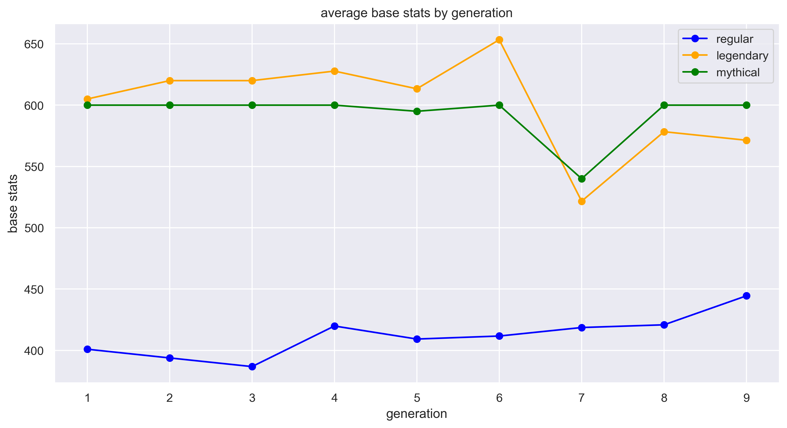
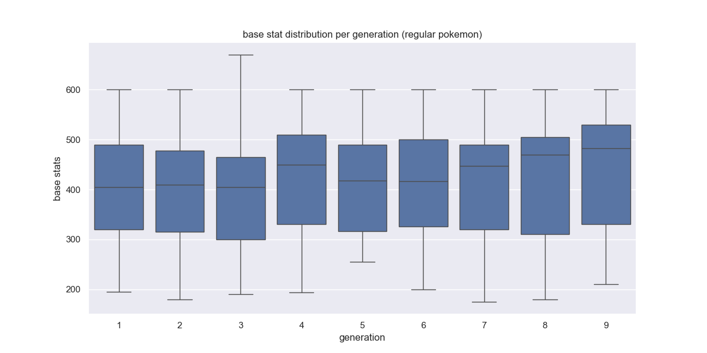
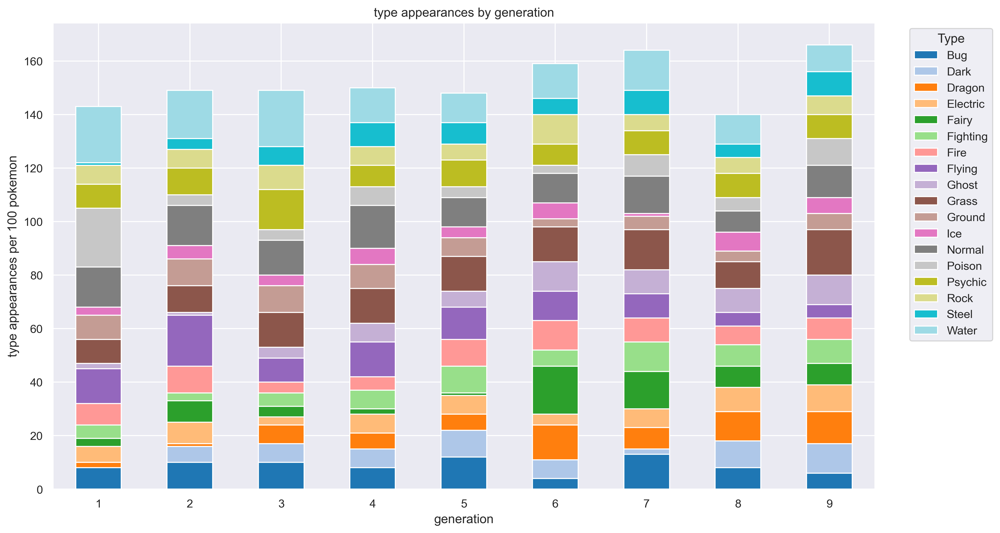
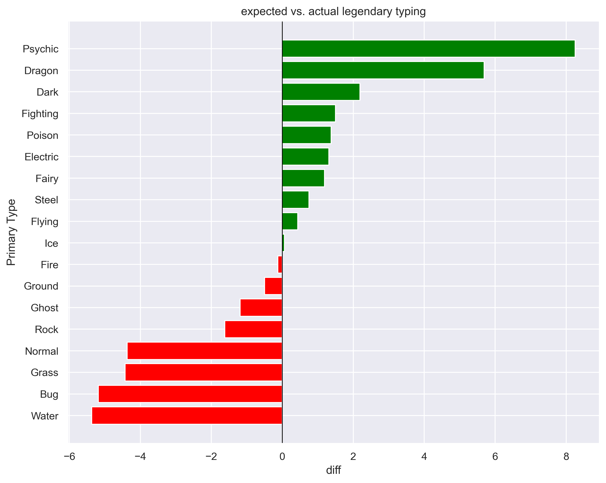

# Pokémon Design Evolution: A Generational Data Analysis

An end-to-end data pipeline exploring how Pokémon design has evolved across 9 generations analyzing base stats, type distribution, and legendary design philosophy using Python, SQL, and statistical testing.

---

## Research Question

**"How has Pokémon design evolved across generations and what do shifts in base stats, type distribution, and special status reveal about the franchise's design philosophy over time?"**

---

## Project Pipeline

```
Raw CSV → Python Cleaning → SQLite Database → SQL Analysis → Statistical Testing → Visualization
```

| Stage | Tools | Description |
|---|---|---|
| 1. Data Cleaning | Python, Pandas | Load raw data, investigate and handle nulls meaningfully |
| 2. Database Loading | Python, SQLite | Load clean data into a relational database |
| 3. SQL Analysis | SQLite, DB Browser | Analytical queries across generations |
| 4. Statistical Testing | Python, SciPy | Correlation, ANOVA, Chi-squared tests |
| 5. Visualization | Matplotlib, Seaborn | Charts that tell the generational story |

---

## Key Findings

### 1. Power Creep is Real But Only for Regular Pokémon
Regular Pokémon show a weak but statistically significant increase in base stats across generations (r = 0.135, p = 0.0016). However Legendaries and Mythicals show no significant pattern. Their design is intentional and consistent regardless of generation.

| Category | Correlation (r) | p-value | Significant? |
|---|---|---|---|
| Regular Pokémon | +0.135 | 0.0016 | ✅ Yes |
| Legendary Pokémon | -0.260 | 0.2265 | ❌ No |
| Mythical Pokémon | -0.174 | 0.9768 | ❌ No |

### 2. Mythicals Are Intentionally Balanced
Mythical Pokémon consistently sit at exactly 600 base stats with even stat distribution (a deliberate design decision by Game Freak to make them feel special and complete without being competitively broken).

### 3. Type Distribution Became More Uniform Over Time
Early generations were dominated by a handful of types (Gen 1: Poison at 22%, Water at 21%). Later generations show a much more even spread across all 18 types suggesting Game Freak may have become increasingly intentional about type ecosystem balance.

### 4. Certain Types Are Disproportionately Legendary (Chi-squared p = 0.0000037)
Psychic and Dragon types are massively over-represented among Legendaries, while Water, Bug, Grass and Normal are heavily under-represented. This reflects deliberate narrative design. Legendaries are designed to feel mysterious and powerful, which maps naturally to Psychic and Dragon archetypes.

---

## Visualizations

### Average Base Stats by Generation

*Regular Pokémon trend upward while Legendary and Mythical stats remain volatile. Note the Gen 7 dip for both categories.*

### Base Stat Distribution per Generation

*Box plots reveal the full spread per generation. Gen 9 shows a clear upward shift in both median and upper range.*

### Type Appearances by Generation

*Counts both Type 1 and Type 2 (values exceed 100% as dual-type Pokémon contribute to two type counts). Early gens show dominant type clusters that become more evenly distributed over time.*

### Expected vs Actual Legendary Typing

*Diverging bar chart showing which types appear more (green) or less (red) among Legendaries than random chance would predict.*

---

## Data Notes & Decisions

- **Null handling**: Type 2 nulls filled with `'N/a'` (single-type Pokémon), gender_male_ratio nulls filled with `-1` (genderless Pokémon), Forms nulls filled with `'Base Only'`
- **Legendary separation**: Legendaries, Mythicals, and Ultra Beasts analyzed separately to avoid skewing generational averages from uneven distribution
- **Ultra Beasts**: Excluded from cross-generational analysis as they are exclusive to Gen 7
- **Type distribution**: Reflects current typings, not original typings at time of release. Retroactive reclassifications (e.g. Clefairy, Jigglypuff reclassified as Fairy in Gen 6) may affect Gen 1 type distribution results
- **RANK() vs ROW_NUMBER()**: Used RANK() in window functions to preserve intentional ties (e.g. legendary trios designed with identical base stats)

---

## Repository Structure

```
pokemon_project/
├── data/
│   ├── pokemon_data.csv               ← raw data (unmodified)
│   └── pokemon_clean.csv              ← cleaned data
├── queries/
│   ├── avg_stats_by_gen.sql           ← regular Pokémon avg stats
│   ├── avg_stats_by_gen_legendary.sql ← legendary avg stats
│   ├── avg_stats_by_gen_mythical.sql  ← mythical avg stats
│   ├── avg_stats_by_gen_ultra_beast.sql
│   ├── type_counts_ratio.sql          ← type distribution with ratios
│   ├── gen_rank_stats.sql             ← ranking all Pokémon within gen
│   ├── gen_rank_stats_legendary.sql
│   └── gen_rank_stats_mythical.sql
├── visuals/
│   ├── avg_stats_by_gen.png
│   ├── base_stat_distribution.png
│   ├── type_appearances_by_gen.png
│   └── expected_vs_actual_legendary_typing.png
├── exploration.ipynb                  ← Stage 1: data cleaning
├── analysis.ipynb                     ← Stages 3 & 4: SQL + stats + viz
├── load_to_db.py                      ← Stage 2: load to SQLite
└── README.md
```

---

## Setup & Usage

### Requirements
```
pip install pandas matplotlib seaborn scipy sqlalchemy
```

### Run the pipeline
```bash
# Stage 1 - Run exploration.ipynb to clean data and export pokemon_clean.csv

# Stage 2 - Load clean data into SQLite
python load_to_db.py

# Stage 3 - Open DB Browser for SQLite and run queries from /queries folder

# Stage 4 - Run analysis.ipynb for statistical testing and visualizations
```

---

## Tools & Libraries

- **Python**: Pandas, Matplotlib, Seaborn, SciPy, SQLite3
- **SQL**: SQLite via DB Browser for SQLite
- **Statistical Tests**: Pearson Correlation, One-way ANOVA, Chi-squared

---

## Dataset

Pokémon dataset covering all 1,025 Pokémon across 9 generations with 48 features including base stats, typing, physical attributes, breeding data, and classification flags.
